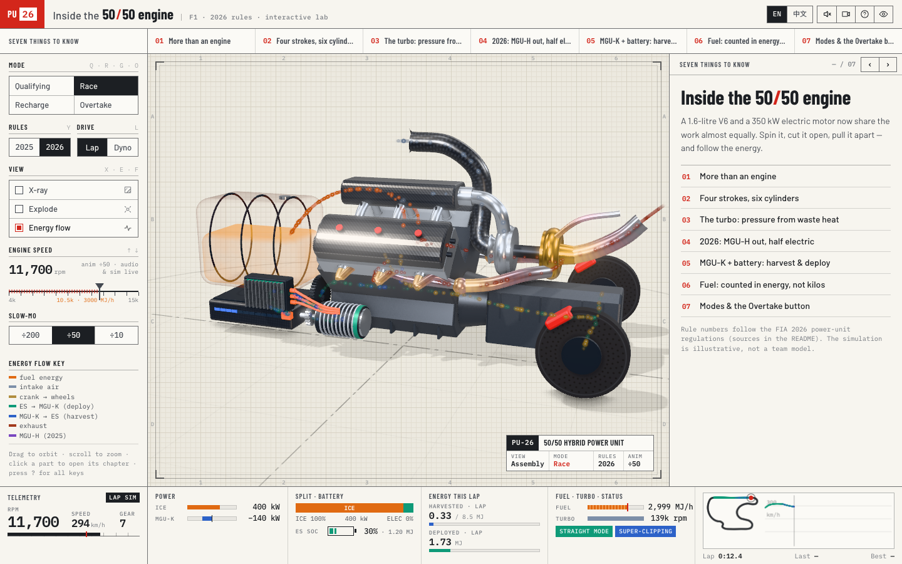
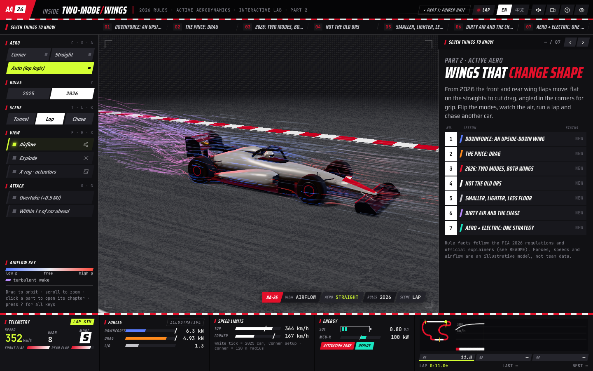

# labs

A collection of small interactive experiments: browser games, explorable explainers and whatever else is fun to build. Everything runs as a static page with no build step, and every model, texture and sound is generated in code at load time.

Most of these were built by Claude Code agents with Claude Opus 5.5. Each project folder keeps the brief the agents were given, and a README that logs how the agents worked.

| | Project | What it is | How it was built |
|---|---|---|---|
| <a href="https://andy78644.com/labs/neon-runner/"></a> | **[Neon Runner](neon-runner/)**<br>[▶ Play](https://andy78644.com/labs/neon-runner/) | A synthwave 3D endless runner. Switch lanes, jump and slide past three kinds of obstacles, collect coins and power-ups. | An orchestrating agent wrote an architecture contract (module interfaces, event bus, shared config and stubs) first. Four sub-agents then built the world, player, hazards/FX and game/UI in parallel, each owning its own files. ~45 min, ~4,750 lines. |
| <a href="https://andy78644.com/labs/f1-2026-power-unit/"></a> | **[Inside the 2026 F1 Power Unit](f1-2026-power-unit/)**<br>[▶ Open](https://andy78644.com/labs/f1-2026-power-unit/) | An explorable explainer for the 2026 F1 power unit: spin the V6, cut it open, explode it, follow the energy between engine, MGU-K and battery, and compare it with 2025. | A single long agent run. It researched the FIA 2026 regulations first, then built the page in a screenshot-and-fix loop with Playwright. |
| <a href="https://andy78644.com/labs/f1-2026-active-aero/"></a> | **[Two-Mode Wings: 2026 Active Aero](f1-2026-active-aero/)**<br>[▶ Open](https://andy78644.com/labs/f1-2026-active-aero/) | Part 2 of the F1 series. Switch a generic 2026-style car between Corner and Straight Mode, watch pressure-coloured airflow and the wake, run a lap that switches modes by itself, chase another car and use Overtake, and compare with 2025 DRS. | A single agent run that reused part 1's design system and Playwright tooling. It researched the FIA 2026 aero rules first, then built the page in small edits with a screenshot-and-fix loop. |

## Run locally

```bash
git clone https://github.com/andy78644/labs.git
cd labs
python3 -m http.server 8080
```

Then open http://localhost:8080/neon-runner/ or http://localhost:8080/f1-2026-power-unit/.

Three.js is loaded from jsDelivr, so you need an internet connection.

## Notes

- Each project folder has its own `README.md` with controls, features and the agent workflow log, plus the original `BRIEF.md`.
- Nothing here has been tested on a wide range of real devices yet. Frame rate and audio were checked in headless browsers only.
