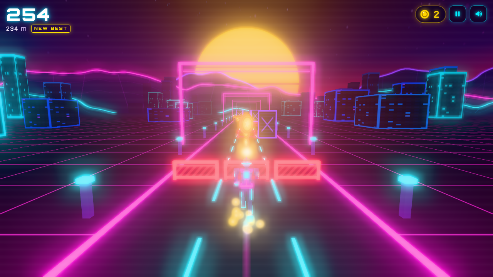

# Neon Runner

A synthwave 3D endless runner in the browser. Three.js r170 loaded through an import map. There is no build step and no asset files: every model, texture, sound effect and music track is generated in code when the page loads.



## Run it

```bash
cd games/neon-runner
python3 -m http.server 8000
# open http://localhost:8000
```

You need an internet connection the first time, because Three.js is loaded from jsDelivr.

## How to play

You run forward automatically, and the speed goes up over time, from 14 m/s to 40 m/s. There are three lanes. Hitting an obstacle ends the run.

| Action | Keyboard | Touch |
|---|---|---|
| Change lane | ← / → or A / D | swipe left / right |
| Jump | ↑ / W / Space | swipe up |
| Slide (fast-fall while in the air) | ↓ / S | swipe down |
| Start / restart | Enter / Space / PLAY button | tap |
| Pause | P / Esc / ❚❚ button | ❚❚ button |
| Mute | M / speaker button | speaker button |

| Obstacle | Look | How to get past |
|---|---|---|
| Fence (`barrier`) | low red fence | **jump** |
| Beam (`bar`) | orange overhead beam | **slide** |
| Wall (`wall`) | tall purple block with an X | **change lane** |

- **Coins** are worth 10 points each.
- **Power-ups:**
  - **Magnet** (10 s) pulls in coins from every lane.
  - **Shield** (15 s) absorbs one hit.
  - **×2** (10 s) doubles your score.
- **Score** is distance plus coins, multiplied while ×2 is active.
- **High score** is saved in `localStorage`.
- The title screen plays an autopilot demo in the background.

## Files

```
index.html  styles.css          page, import map, HUD styling
ARCHITECTURE.md                 the contract (coordinates, time step, interfaces, events)
src/config.js                   every tuning number (speed curve, jump, spawn odds, durations, colors)
src/events.js                   event bus + list of all event names and their payloads
src/world.js  src/textures.js   track chunks, grid, sky/sun/mountains, lights, bloom
src/player.js src/input.js      runner model and animation, hitbox, keyboard and touch
src/spawner.js src/effects.js   obstacles/coins/power-ups, pools, collisions, particles, camera shake
src/main.js src/game.js         bootstrap, fixed-step loop, state machine, rules
src/hud.js  src/audio.js        DOM screens and synthesized sound effects and background music
dev/                            dev-only test harnesses (Playwright) — not needed to play
docs/screenshots/               real screenshots taken during the integration play-test
```

Coordinates: the player stays at z = 0 and the world scrolls toward +z. The lanes are at x = −2.4, 0 and +2.4. The simulation uses a fixed 1/60 s time step. Details are in `ARCHITECTURE.md`.

## Running the play-test

```bash
npm install                      # dev-only: Playwright (local node_modules)
python3 -m http.server 8110 &
node dev/integration/playtest.mjs 8110
```

`dev/launch.mjs` expects a Playwright Chromium in `~/Library/Caches/ms-playwright`. You can override it with `CHROME_PATH=...`.

---

## Agent workflow log

This project tested the workflow used by [Turbo Kart Rally](https://github.com/bridge-mind/turbo-kart-rally). One orchestrator agent wrote the architecture contract first. Four worker sub-agents then built their parts **in parallel**, each allowed to edit only its own files. Finally the orchestrator integrated the parts and play-tested the game in a real headless browser.

### Timeline (2026-09-27, local time)

| Time | Step |
|---|---|
| 22:17 – 22:23 (~6 min) | Orchestrator wrote the contract and stubs, checked that the stubs ran in headless Chromium, and committed them (`2b9d8d0`) |
| 22:24 | All 4 workers started in one message (parallel `Agent` calls) |
| 22:36 | Worker 1 (World) finished — 11.8 min |
| 22:38 | Worker 3 (Hazards & FX) finished — 14.2 min |
| 22:39 | Worker 2 (Player) finished — 14.8 min; Worker 4 (Game & UI) finished — 15.0 min |
| 22:39 – 22:58 (~19 min) | Integration play-test, fixes, screenshots, README |

Total wall-clock time was about 45 minutes. The parallel phase took about 15 minutes, compared with about 56 minutes of summed worker time.

### What the contract contained (written before any worker started)

- **`ARCHITECTURE.md`:**
  - axes: +x right, +y up, −z forward
  - the player is fixed at z = 0 and the world scrolls toward +z
  - lane x values
  - hitbox rules
  - the fixed 1/60 s step and the order of calls inside `game.update()`
  - the full method signature of every class
  - a table of which module emits and which listens to each event
  - collision and power-up rules
  - a testing protocol for each worker (assigned port, shared Playwright launcher, a harness folder per worker)
  - the `window.__NEON__` test hook
- **`src/config.js`:**
  - the speed curve `start + (max−start)(1−e^(−t/τ))`
  - player dimensions and jump height/time (gravity is derived from these)
  - obstacle dimensions chosen so that exactly one action clears each type: fence top 0.9 m below the jump; beam bottom 1.15 m, between the slide height 0.7 m and the standing height 1.7 m; wall 3.2 m, above the jump apex
  - rules that guarantee a clear path
  - spawn probabilities, pool sizes, power-up durations, camera, bloom, audio and the color theme
- **`src/events.js`:** a working event bus (`on/off/once/emit`) and 29 event names with payload shapes. It warns about unknown event names to catch typos during integration.
- **Stubs:** stubs for all 12 owned files, each with its final export signatures and a harmless minimal body. The game booted with zero errors while it was still only stubs, so every worker could test against a running game.
- **`dev/launch.mjs`:** a shared headless-Chromium launcher (SwiftShader WebGL), after checking that WebGL2 and jsDelivr were both reachable.

### What each worker delivered

| Worker | Files (lines) | Delivered | Self-test |
|---|---|---|---|
| 1 · World | world.js 441, textures.js 338 | 7 recycled 40 m chunks (about 42 draw calls in total): world-UV neon grid, dashed lane lines, edge rails, gates, instanced wireframe buildings; sky dome with stars, striped sun, 3 mountain layers; NeutralToneMapping and an UnrealBloom composer | 0 errors; grid and obstacle drift measured at 5e-12 m after 1000 steps; resize and dispose checked |
| 2 · Player | player.js 677, input.js 141 | runner model built from primitives with knee and elbow joints and glowing trim; run, jump, slide and fast-fall; banking during lane changes; 3 death animations; fresnel shield bubble; light trail; keyboard and swipe/tap input | 52/52 checks: apex 1.9987 m, airtime 0.650 s, lane tween 0.133 s, slide hitbox 0.7 m, real CDP touch swipes |
| 3 · Hazards & FX | spawner.js 717, effects.js 322 | pools for 7 object types; row generator that guarantees a path, using lane reachability; coin trails that arc over fences and dip under beams; AABB collisions that are swept by the last step so fast objects can't tunnel; magnet; a GPU particle system on one `Points` shader; shake that doesn't drift | 39/39 checks: 8000 m at 5 speeds with 0 impassable rows; all 9 obstacle × pose cases; pools stayed bounded over a 21 km run |
| 4 · Game & UI | game.js 442, main.js 95, hud.js 275, audio.js 391, index.html 28, styles.css 312 | state machine, score and power-up rules, death sequence, demo autopilot, title/HUD/pause/results screens, synthesized sound effects and music loop (Am–F–C–G, lookahead scheduler, filter that opens as speed rises) | about 52 checks, 0 errors on desktop and mobile; tested against modules that had already become real mid-run |

### What broke at integration, and how it was fixed

All four parts connected on the first try. **There was no interface mismatch.** The first full play-test passed every mechanic check that exercised real `spawner.collide()` hits: all 9 obstacle × action combinations, death, results, high score, pause and audio. The problems found were:

1. **The play-test script didn't reset the player's lane between trials.** The "lane change avoids wall" trial left the runner in lane 0. The coin and power-up trials then placed items in lane 1 and reported 0 pickups. This was a harness bug, not a game bug, and the fix was to re-center the runner in `freshRun()`.
2. **Headless SwiftShader is slow.** The first mobile context took about 13 s to render its first frame while the desktop context was still rendering, so `waitForFunction` timed out. The demo-distance check also sampled during shader compilation and saw 0.3 m. Fixes:
   - close the desktop context before the mobile phase
   - wait for `stats.frames`
   - measure item pickups in *simulated* time (`game.time`) instead of wall-clock time

   Worker 4 had flagged this risk in its report.
3. **Bloom haze.** With threshold 0.12 and strength 1.05, the frame was washed out, most visibly on the phone viewport. Workers 1 and 3 both reported this and worked around it in their own files by dimming emissive colours. The contract owner then changed `CONFIG.world.bloom` to strength 0.85, radius 0.5 and threshold 0.2. This is the **only change made to any contract file after the workers started.**
4. The first version of screenshot 07 was taken before the impact. It now waits for `player.state === 'dead'`.

Contract ambiguities the workers reported, and which the code now handles:
- The coin `Hit` has no `value` field, so game.js uses `CONFIG.coin.value`.
- The rule to ignore keys while a `<button>` has focus would have disabled the arrow keys after clicking a HUD button. input.js only ignores Space and Enter on buttons, and hud.js releases focus after a click.
- The demo autopilot needs `getObstaclesAhead` to include rows until they are fully behind the runner (`zMin` > 0).
- The ~1 s death sequence freezes the world scroll so the obstacle stays with the fallen runner.

### Final integration check (`dev/integration/playtest.mjs`): 30/30 passed

These were checked in headless Chromium with real keyboard events and synthesized touch pointer events:
- boots to the title with the demo running
- Enter starts a run, and the AudioContext is running after that gesture
- each obstacle type kills a runner who does nothing or does the wrong action, and is cleared by the right action (jump over the fence, slide under the beam, change lane around the wall)
- 5/5 coins in a lane are collected
- each power-up is picked up from the track and activates
- the magnet pulls 8 coins from the side lanes
- the shield absorbs a wall hit
- ×2 sets the multiplier to 2
- death → results → high score in `localStorage` → Enter restarts → the high score survives a reload
- pause freezes the simulation
- a 45 s soak run with natural spawns and a simple keyboard bot covered 916 m at up to 25 m/s, with 75 coins, a power-up and 0 hits
- a swipe on a 390×844 touch viewport changes lane
- zero console errors

### Known limitations

- Performance could only be measured under software rendering (about 5–13 fps with SwiftShader). The design choices aim for 60 fps on a real GPU: about 42 draw calls for the world, pooled objects, one particle draw call and no per-frame allocations. This was **not** checked on real hardware or on a physical phone.
- Audio is verified as a running AudioContext with scheduled notes. Nobody has actually listened to it.
- On narrow portrait screens, a runner in an outer lane sits near the edge of the frame. main.js widens the vertical field of view in portrait to compensate.
