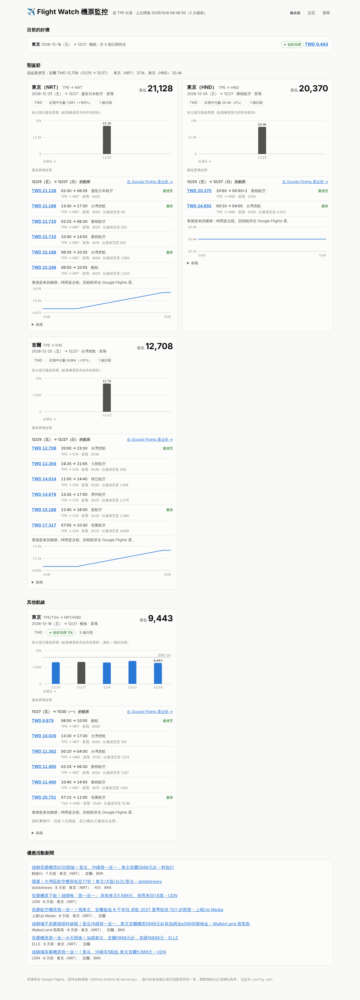
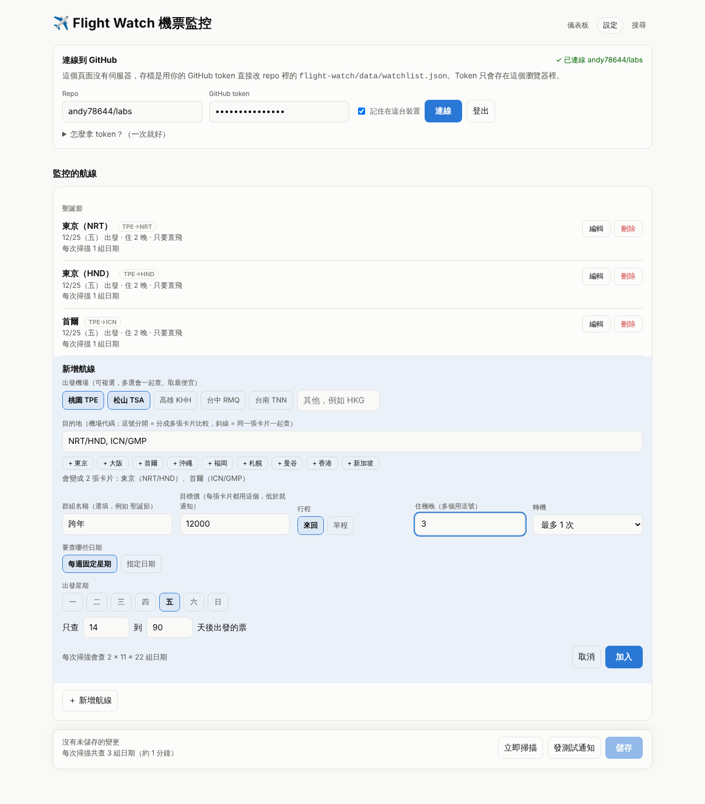
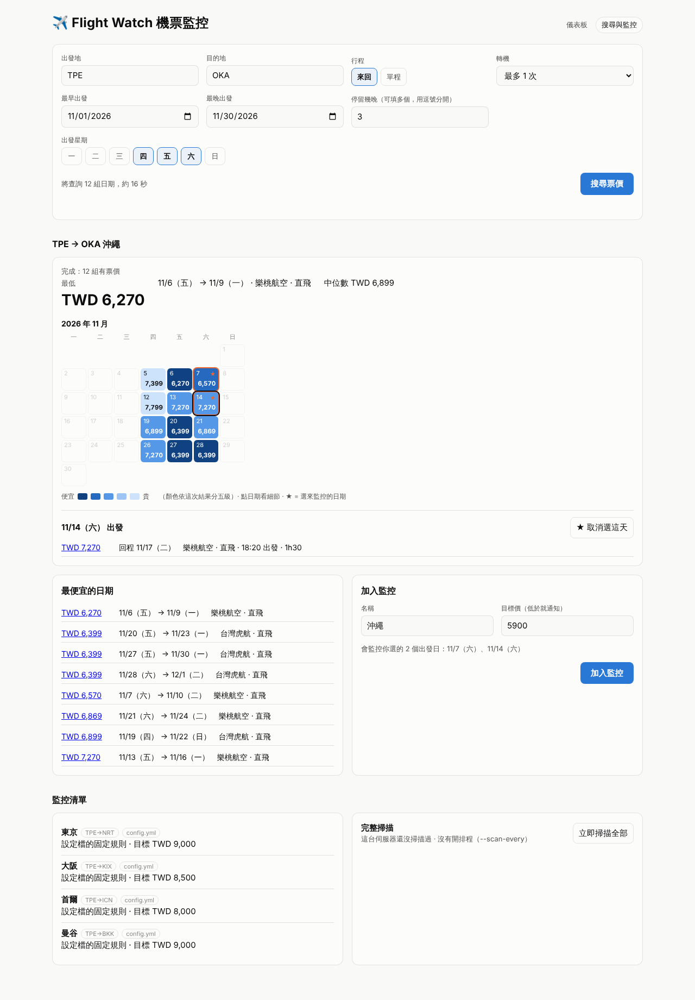

# Flight Watch 機票監控

A small fare monitor. You pick a few destinations. A GitHub Actions job then scans fares every 6 hours, keeps a price history, flags deals and searches the news for airfare promotions. A static dashboard shows the results, and alerts can go to Telegram or Discord.



## Flight options

Each date pair keeps up to 6 flights, not just the cheapest one:
- the cheapest per airline and departure time;
- the cheapest nonstop;
- the fastest flight.

On the dashboard, click a bar to see that day's flights with times, airports, stops, duration and how much more each costs than the cheapest. The price shown is the round-trip total; the times are for the outbound flight.

## How it works

```
config.yml ──▶ scanner (GitHub Actions, every 6 h) ──▶ data/*.json ──▶ index.html (dashboard)
                     │                                       │
                     ├─ Google Flights: cheapest fare per date pair
                     ├─ Google News RSS: promotion stories per destination
                     └─ Telegram / Discord: new deals and promotions only
```

- **Fares.** For each route the scanner queries every departure day you choose (by default every Friday 14–90 days out, with a 4-night stay). It keeps the cheapest itinerary. Because the departure days are fixed weekdays, the same date pairs come back scan after scan, so each one builds its own price history.
- **Deals.** A fare counts as a deal when:
  - it is at or below the route's `alert_below` target, or
  - it is `drop_pct` % (default 15 %) below the median price of that same date pair over the last `baseline_days`. This check only starts once there are `min_samples` past scans.
- **No repeat alerts.** You hear about a deal the first time it appears, and again only if it gets cheaper. That state is kept in `data/alert_state.json`.
- **Promotions.** The scanner searches Google News for `機票 優惠 <destination>`, plus any RSS/Atom feeds you list. It keeps headlines that name a destination and contain a sale keyword (`買一送一`, `早鳥`, `限時`, …). Syndicated copies of the same story are merged.
- **Data** is committed back to the repo, so GitHub Pages serves the dashboard together with its data. `history.json` is pruned after `history_days`.

## Settings page (no server needed)

`settings.html` is where you choose what gets watched. It runs on GitHub Pages and saves straight to the repo through the GitHub API, using a token that stays in your browser.



- Add, edit and delete routes. For each route you set:
  - name, origin, destination and target price;
  - round trip or one way, nights and stops;
  - which dates to check: either "every Friday 14–90 days out" or specific dates (a single day or a range).
- **Several airports in one search.** Tick more than one origin (e.g. Taoyuan TPE + Songshan TSA), or write a destination as `NRT/HND`. Google Flights then searches all of them in one query and keeps the cheapest. This doesn't add queries.
- **Several destinations at once.** Separate destinations with commas, e.g. `NRT/HND, ICN, OKA`, to create one route card each with the same dates. Give them a group name such as 聖誕節 and the dashboard shows them in one section, with a line saying which destination is cheapest.
- Every route and the whole list show how many queries a scan will make. The page warns above about 120.
- **儲存** commits `data/watchlist.json` to `main`, and the next scheduled scan uses it.
- **立即掃描** starts a scan now. **發測試通知** checks the Telegram/Discord setup.

One-time setup: create a [fine-grained token](https://github.com/settings/personal-access-tokens/new) that only covers this repo, with **Contents: Read and write**. For the scan and test buttons it also needs **Actions: Read and write**. Paste it into the page. The page keeps it in this browser's storage, which other pages on the same domain can read too, so don't tick "記住" on a shared computer.

Routes are stored in `data/watchlist.json`. `config.yml` keeps the defaults (stay length, window, stops) and the alert and promotion settings. Routes written there still work, but the page can't edit them.

## Search page and running it on your own machine

`server.py` runs everything in one process: the dashboard, a **search page** and an optional scheduler. Use it when you want to pick dates yourself, or to run the scans on your own computer or a server instead of GitHub Actions.



On the search page (`/search.html`) you can:

- pick an origin and destination, a departure date range, the departure weekdays, how many nights to stay and the maximum number of stops;
- run a live search against Google Flights. You get a calendar shaded by price, the cheapest dates, and the details for each day with links to Google Flights. One search can cover up to 80 date pairs; 24 pairs took about 15 seconds;
- star the days you care about, set a target price, and **add them to the watchlist**. Watches are saved in `data/watchlist.json`. Scheduled scans pick them up, and they show on the dashboard with a "網頁新增" tag;
- remove watches, or start a full scan right away.

```bash
cd flight-watch
.venv/bin/python server.py                    # http://127.0.0.1:8000/  (search: /search.html)
.venv/bin/python server.py --scan-every 6     # also scan every 6 hours, no GitHub Actions needed
```

On a server or VPS, listen on all interfaces and **set a token**. Without one, anyone who finds the URL can run searches and edit the watchlist:

```bash
FLIGHT_WATCH_TOKEN=pick-a-password .venv/bin/python server.py --host 0.0.0.0 --scan-every 6
# or with Docker; data/ is a volume so history survives restarts
docker build -t flight-watch .
docker run -d -p 8000:8000 -v fw-data:/app/data -e FLIGHT_WATCH_TOKEN=pick-a-password \
  -e TELEGRAM_BOT_TOKEN=... -e TELEGRAM_CHAT_ID=... flight-watch
```

The search page asks for the token once and remembers it in the browser. The GitHub Pages copy only has the dashboard, because live search needs the server.

If you use both the server and GitHub Actions, they keep separate data unless you commit the server's `data/` folder (including `watchlist.json`) back to the repo.

## Setup

1. **Pick routes** on the settings page (`settings.html`, see above), or edit `data/watchlist.json` by hand. Each route can set `dates: [2027-02-05]` to check only that date, or `stay_nights: [7, 10]` to check two trip lengths. The defaults are in [`config.yml`](config.yml).
2. **Alerts (optional).** In the repo, open *Settings → Secrets and variables → Actions* and add:
   - Telegram: `TELEGRAM_BOT_TOKEN` (from @BotFather) and `TELEGRAM_CHAT_ID`
   - Discord: `DISCORD_WEBHOOK_URL`
   - Optionally, add a *variable* `FLIGHT_WATCH_DASHBOARD_URL` so alerts link to the dashboard.

   To check the setup, run the workflow by hand with **只發一則測試通知** ticked. It sends one test message and doesn't scan.

   With no secrets set, the scan still runs. Alerts then only appear in the Actions run summary.
3. **Schedule.** [`.github/workflows/flight-watch.yml`](../.github/workflows/flight-watch.yml) runs at minute 17 every 6 hours (UTC). GitHub only runs scheduled workflows from the default branch, so the workflow must be on `main`. You can also start a scan by hand from the Actions tab (*Run workflow*).
4. **Dashboard:** https://andy78644.com/labs/flight-watch/ (once merged and Pages has deployed).

## Run locally

```bash
cd flight-watch
python3 -m venv .venv && .venv/bin/pip install -r requirements.txt
.venv/bin/python -m scanner.scan --no-notify            # real scan, writes data/
.venv/bin/python -m scanner.scan --only NRT --dry-run   # one route, write nothing
.venv/bin/python -m scanner.scan --provider demo --data-dir /tmp/fw   # offline fake fares
.venv/bin/python -m unittest                            # tests
python3 -m http.server 8000                             # dashboard at http://localhost:8000/
```

## Cost and limits

- **No API key is needed.** Fares come from Google Flights through the open-source [`fast-flights`](https://github.com/AWeirdDev/fast-flights) scraper. It is an unofficial interface: Google can change its page or rate-limit you, and prices can differ a little from what you see at checkout. The scanner waits `delay_seconds` between requests. With the default config, a scan is 44 requests and takes about 3 minutes.
- **If Google blocks the GitHub runners**, a scan with zero fares fails loudly and leaves the last good data in place. In that case, run the scanner on your own machine with cron, or add another provider in `scanner/providers.py`. A provider is one class with a `search()` method.
- **Promotions come from news headlines**, not from airline sites, so a sale shows up once a news site writes about it (usually the same day for big sales). Google News RSS is for personal, non-commercial feed reading. That fits this use, but don't republish the feed.
- **Scan frequency vs. repo size:** each scan adds one small commit. Every 6 hours, the data stays well under 1 MB with 180 days of history.

## Files

| Path | What it is |
|---|---|
| `config.yml` | search defaults, alert rules, promotion keywords |
| `scanner/scan.py` | entry point: one full scan |
| `scanner/providers.py` | Google Flights provider, plus a demo provider |
| `scanner/deals.py` | median baselines, deal rules, alert de-duplication |
| `scanner/promos.py` | Google News / RSS promotion watcher |
| `scanner/notify.py` | Telegram, Discord and Actions-summary output |
| `data/latest.json` | the latest scan (what the dashboard draws) |
| `data/history.json` | per-route, per-date price history |
| `data/promos.json` | recent promotion headlines |
| `index.html` | the dashboard (no build step) |
| `settings.html` | route editor that saves to the repo via the GitHub API |
| `search.html` | live search and watchlist editor (needs `server.py`) |
| `server.py` | web server, search API, watchlist API, optional scheduler |
| `data/watchlist.json` | the watched routes (edited by the settings and search pages) |
| `Dockerfile` | runs `server.py` with a 6-hour scan schedule |
